# スクロール移動量の実機確認 — v4.4.6 build 420

> この資料はbuild 420の旧設定（1目盛り = 本文1行）の記録です。**build 421以降は1目盛り = 本文3行（97.5 UI単位）**に変更しています。以下の動画・実測値は撮影当時のものです。

ロビー・ステージの両方で、以下の6条件すべてが **ホイール1目盛り = 本文1行** になりました。DRAW HISTORYも10件・50件で移動量は同じです。

各ページの実操作をGIFとMP4にまとめました。ゲームを起動せず、スマートフォンや別のPCから確認できます。

## 比較表

表は下方向へ1目盛り入力した結果です。数値の単位はUnityのUI座標で、**本文1行は32.5 UI単位**です。カード1枚・履歴1件を1行とは数えていません。

| ページ / 条件 | ロビーの移動量 | ステージの移動量 | 移動行数 | MP4 |
| --- | ---: | ---: | ---: | --- |
| ROLE GUIDE | 32.497 | 32.499 | 両方 1.000行 | [ロビー](media/lobby-guide.mp4?raw=true) / [ステージ](media/stage-guide.mp4?raw=true) |
| BASE UPGRADES | 32.500 | 32.500 | 両方 1.000行 | [ロビー](media/lobby-base.mp4?raw=true) / [ステージ](media/stage-base.mp4?raw=true) |
| TOOLS | 32.500 | 32.500 | 両方 1.000行 | [ロビー](media/lobby-tools.mp4?raw=true) / [ステージ](media/stage-tools.mp4?raw=true) |
| REPORT A PROBLEM（画面名: BUG REPORT） | 32.500 | 32.500 | 両方 1.000行 | [ロビー](media/lobby-report.mp4?raw=true) / [ステージ](media/stage-report.mp4?raw=true) |
| DRAW HISTORY・10件 | 32.499 | 32.499 | 両方 1.000行 | [ロビー](media/lobby-history10.mp4?raw=true) / [ステージ](media/stage-history10.mp4?raw=true) |
| DRAW HISTORY・50件 | 32.499 | 32.499 | 両方 1.000行 | [ロビー](media/lobby-history50.mp4?raw=true) / [ステージ](media/stage-history50.mp4?raw=true) |

| 追加確認（ステージ・履歴50件） | 移動量 | 移動行数 | MP4 |
| --- | ---: | ---: | --- |
| 上方向へ1目盛り | −32.498 | −1.000行 | [再生 / 保存](media/stage-history50-up.mp4?raw=true) |
| 下方向へ5目盛り相当をまとめて入力 | 162.498 | 5.000行 | [再生 / 保存](media/stage-history50-five.mp4?raw=true) |

[測定値CSV](measurements.csv)には動画名・方向・入力数・測定値を収録しています。

## 動画の見方

以下のページ名を開くとGIFが繰り返し再生されます。MP4は拡大・一時停止して確認できます（ブラウザーによってはダウンロードされます）。各動画は6.5秒です。

画面上部の表示が `WHEEL DOWN x1 | settling...` に変わった瞬間が入力です。その約1秒後に `moved … UI | … lines` が確定します。入力前は直前の測定結果が残っている場合があるため、**入力後の数値**を見てください。

本文の同じ文字の位置を、入力前後で比較してください。スクロールバーのつまみの移動距離はページの総量によって変わりますが、本文の移動量は一定です。

ROLE GUIDE — ロビー / ステージ

ロビー: 32.497 UI / 1.000行

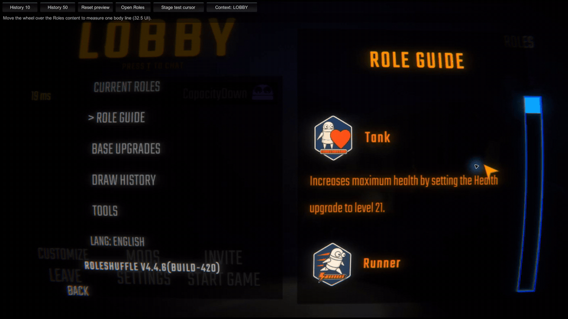

ステージ: 32.499 UI / 1.000行

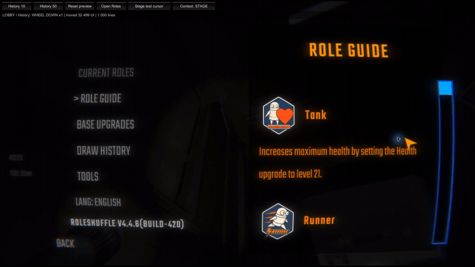

BASE UPGRADES — ロビー / ステージ

ロビー: 32.500 UI / 1.000行

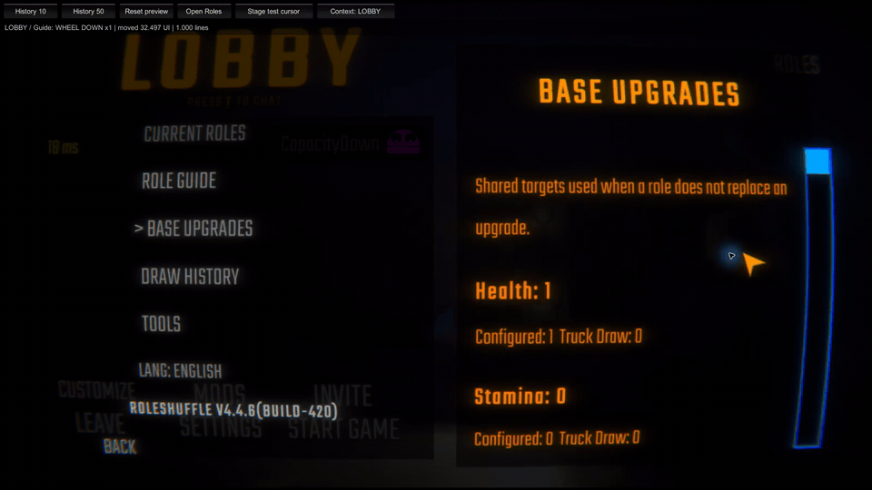

ステージ: 32.500 UI / 1.000行

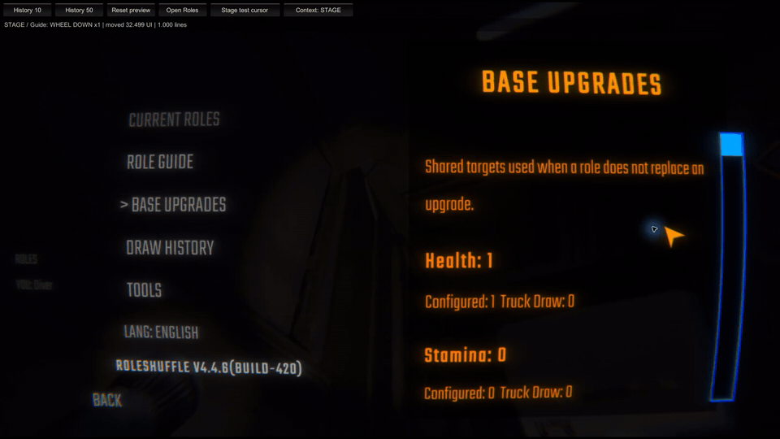

TOOLS — ロビー / ステージ

ロビー: 32.500 UI / 1.000行

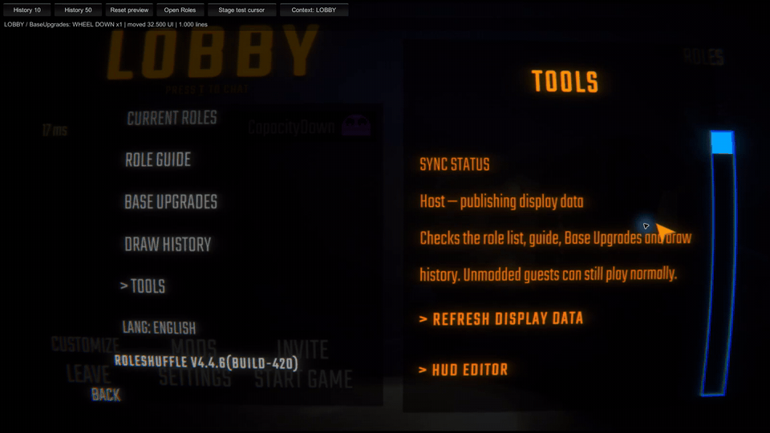

ステージ: 32.500 UI / 1.000行

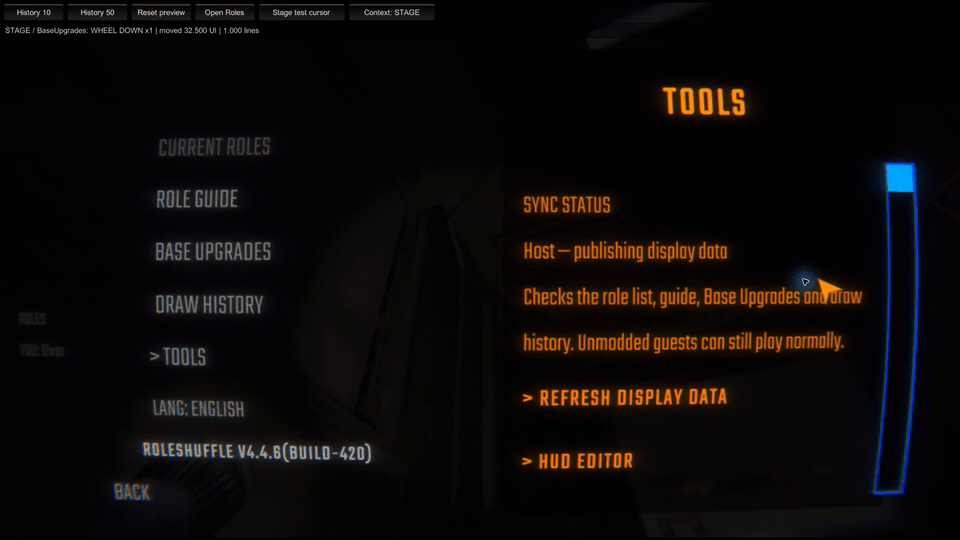

REPORT A PROBLEM — ロビー / ステージ

ロビー: 32.500 UI / 1.000行

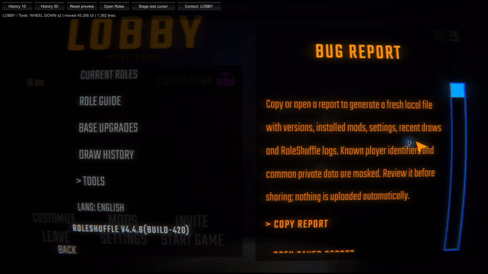

ステージ: 32.500 UI / 1.000行

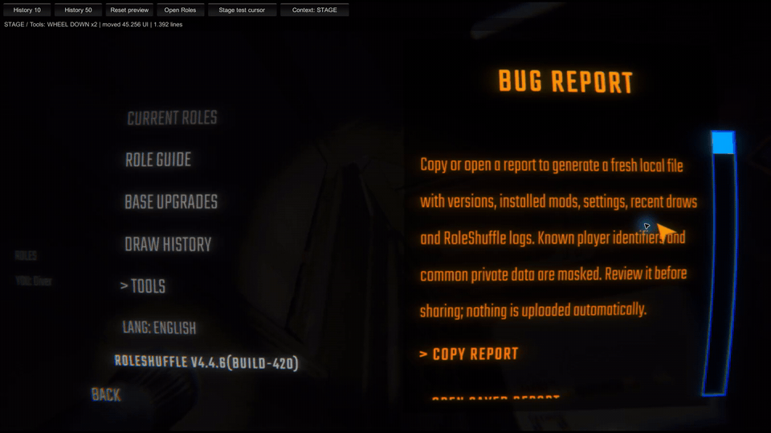

DRAW HISTORY・10件 — ロビー / ステージ

ロビー: 32.499 UI / 1.000行

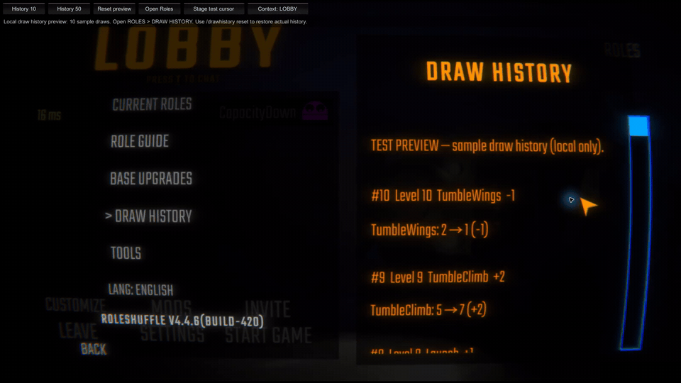

ステージ: 32.499 UI / 1.000行

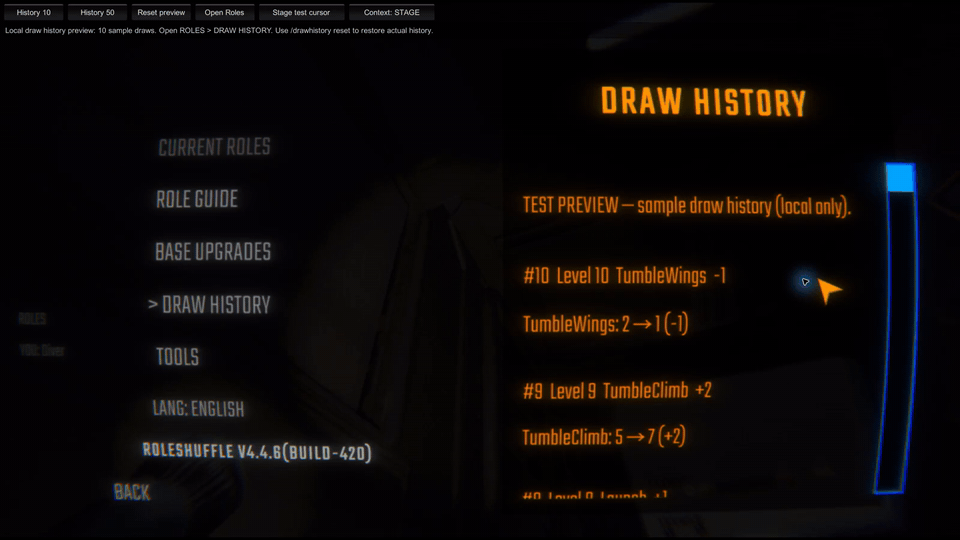

DRAW HISTORY・50件 — ロビー / ステージ

ロビー: 32.499 UI / 1.000行

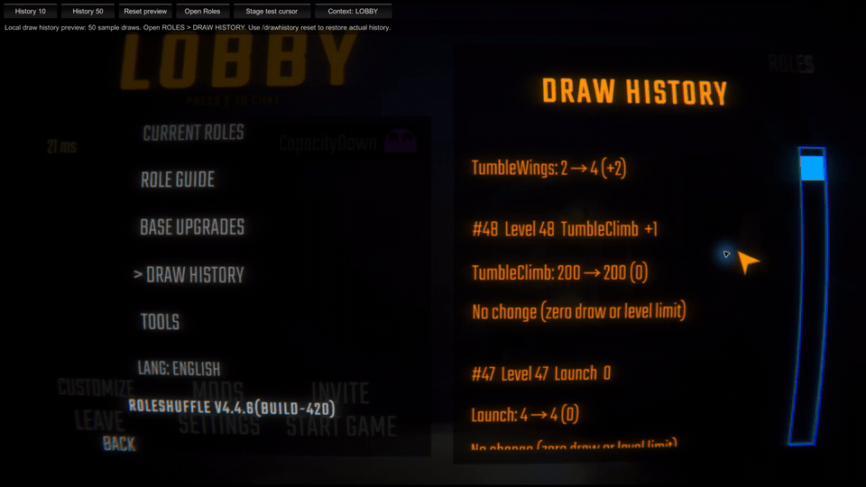

ステージ: 32.499 UI / 1.000行

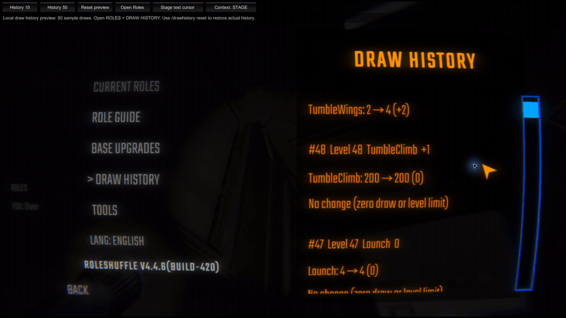

追加確認 — 上方向1目盛り / 下方向5目盛り相当

上方向1目盛り: −32.498 UI / −1.000行

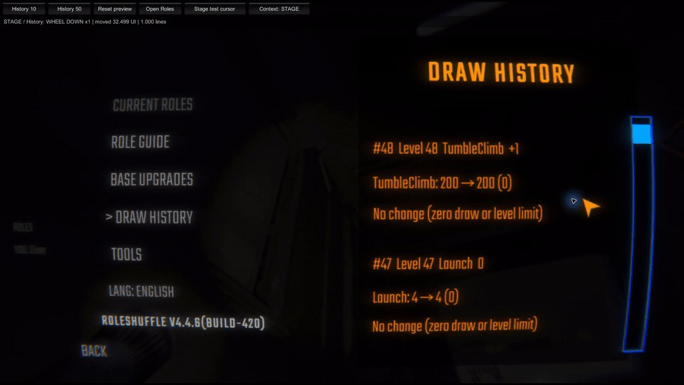

下方向5目盛り相当: 162.498 UI / 5.000行

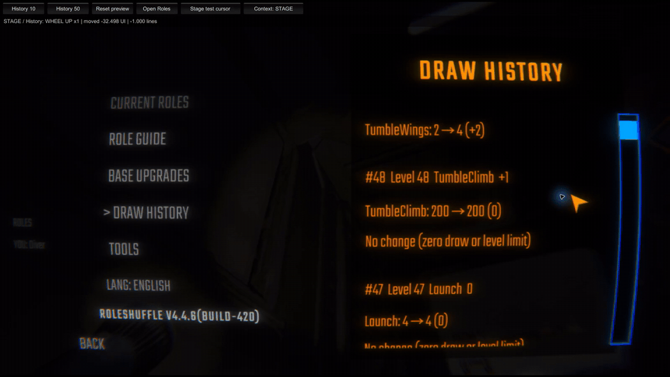

## 測定条件と範囲

- 2026年9月12日、Windows、R.E.P.O. 0.4.4.3、MenuLib 2.5.4、RoleShuffle v4.4.6 build 420。
- Thunderstore Mod ManagerのDefaultプロファイル、英語UI、2560 × 1440。実際のロビーと、ゲーム開始後のステージで測定。
- 操作ツールから実行中のゲームウィンドウへWindowsのホイールイベントを送信。1目盛りは120、5目盛り相当は600。物理マウスを人の手で回した検証ではありません。
- 一時的なローカル計測プラグインで、入力前と最後の入力から1秒後の本文位置を読み取りました。スクロール入力・計算・レイアウトは変更していません。画面上部のボタンと計測表示は検証用です。
- 履歴の作成とRoles画面の表示には製品内の既存処理を呼び出しました。ステージで検証ボタンを操作するため、Roles画面を閉じている間だけ一時的にカーソルを表示しました。
- 本文行の基準は高さ25 + 上下余白3ずつ + 行間1.5 = 32.5 UI単位。実測の最大差0.003 UIは、アニメーションの収束と浮動小数点の誤差の範囲です。許容差0.01 UIで比較し、行数は小数第3位に丸めています。
- 上端・下端では残りの距離までで停止します。TOOLSで1行移動後にさらに2目盛り送ると、残り45.256 UI（1.392行）で下端に達しました。これは両方の場所で同じでした。
- CURRENT ROLESは1人分の表示が画面内に収まり、スクロール余地がないため移動量を測定できませんでした。キーボード操作と他のゲームメニューは今回の動画確認の対象外です。

録画は実操作を等速で切り出したものです。MP4は1600 × 900 / 30 fps、GIFは同じ映像を960 × 540 / 12 fpsに変換しています。ロビー・履歴10件の動画は、右下に映り込んだSteam通知だけを黒塗りしています。本文と計測値は加工していません。

検証後は履歴プレビューを解除し、一時プラグインを取り外してゲームを再起動しました。製品DLLは検証前後で同一です。

## 手元で再確認する場合

1. MOD設定の `Testing > Enabled` を有効にします。
2. ロビーでチャットに `/dh 10` を入力し、`ROLES > DRAW HISTORY` を開きます。
3. 本文上にカーソルを置き、ホイールを1目盛り回します。同じ本文の文字が1行分動くことを確認します。
4. `/dh 50` に切り替えて同じ操作を行います。件数を増やしても本文の移動量は変わりません。
5. ステージに入って、同じページと操作を確認します。
6. `/dh reset` で実際の履歴表示に戻し、不要ならTestingを無効にします。

プレビューは表示専用で、セーブ・実際の抽選履歴・能力値には反映されません。動画では上部の検証ボタンから、このコマンドと同じプレビュー処理を呼び出しています。

## 対象コード

- 製品コミット: [1b84316876b6143a10d948d5275790d5bc10184d](https://github.com/CapacityDown/RoleShuffle/commit/1b84316876b6143a10d948d5275790d5bc10184d)
- 製品DLLのSHA-256: `0B4A7CD4B70BF738588B2850B66BF3F6D59D0BEE8F4B6B1B0BF683BE013FA0ED`
- [ScrollChecks](../../../tools/ScrollChecks/README.md): ゲーム本体の命令へ製品パッチを適用する自動検証。build 420で71項目成功。今回の実操作確認は、入力・描画・パッチ適用の確認を補います。
